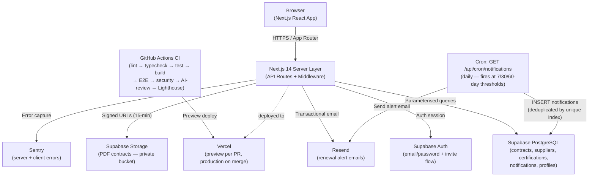

# Contracker

Contract & Supplier Management Platform built with Next.js 14, Supabase, and deployed on Vercel.

[](https://github.com/CS-7180/Contracker/actions/workflows/ci.yml)
[](https://github.com/CS-7180/Contracker/actions/workflows/deploy.yml)
[](https://contracker.vercel.app)

> **Live app:** [https://contracker.vercel.app](https://contracker.vercel.app)

---

## Architecture



---

## Getting Started

### 1. Install dependencies

```bash
npm install
```

### 2. Configure environment variables

```bash
cp .env.local.example .env.local
```

Fill in `.env.local` with your real values (see `.env.local.example` for required keys).

### 3. Run the development server

```bash
npm run dev
```

Open [http://localhost:3000](http://localhost:3000).

---

## Development Commands

| Command | Description |
|---------|-------------|
| `npm run dev` | Start development server |
| `npm run build` | Build for production |
| `npm run type-check` | TypeScript type check |
| `npm run lint` | ESLint |
| `npm test` | Run unit + integration tests (211 tests) |
| `npm run test:watch` | Tests in watch mode |
| `npm run test:e2e` | Playwright E2E tests (7 specs) |

## Running Tests

Create a `.env.test` file (gitignored) with the same keys as `.env.local.example` before running tests:

```bash
cp .env.local.example .env.test
# fill in .env.test with real values
npm test
```

---

## Project Structure

```
app/
├── (auth)/login, signup       → Auth pages
├── (app)/                     → Protected app pages
│   ├── dashboard/             → Traffic-light risk dashboard
│   ├── contracts/             → Contract CRUD + PDF upload
│   ├── suppliers/             → Supplier CRUD
│   ├── compliance/            → Certification tracking
│   ├── spend/                 → Spend analytics (Recharts)
│   ├── notifications/         → In-app renewal alerts
│   └── settings/team/         → Team management (Admin only)
├── api/                       → Next.js API routes
│   ├── contracts/, suppliers/
│   ├── certifications/, notifications/
│   ├── dashboard/, spend/, team/
│   └── cron/notifications/    → Daily alert cron
components/                    → shadcn/ui + custom components
lib/
├── risk.ts                    → getContractStatus(), getRiskColour() — primary TDD targets
├── alerts.ts                  → shouldSendAlert() — alert threshold logic
supabase/migrations/           → SQL schema + seed data
__tests__/                     → Vitest unit + integration tests (211)
e2e/                           → Playwright E2E specs (7)
session_logs/                  → Development session logs
docs/                          → PRD, schema, API design, sprint plan
```

---

## Tech Stack

| Layer | Technology |
|-------|-----------|
| Framework | Next.js 14 (App Router) + React 18 |
| Database | Supabase (PostgreSQL + RLS + Auth + Storage) |
| Styling | Tailwind CSS v3 + shadcn/ui (Radix UI) |
| Animation | Framer Motion |
| Charts | Recharts |
| Email | Resend |
| Testing | Vitest + React Testing Library + Playwright |
| CI/CD | GitHub Actions (8 stages) + Vercel |
| Error Tracking | Sentry |
| Uptime | Better Uptime |

---

## Docs

- [Product Requirements](docs/PRD.md)
- [Database Schema](docs/database-schema.md)
- [API Design](docs/api-design.md)
- [Architecture](docs/architecture.md)
- [Acceptance Criteria](docs/acceptance-criteria.md)
- [Sprint Plan](docs/sprint-plan.md)
- [Security](docs/security.md)
